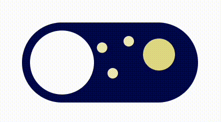
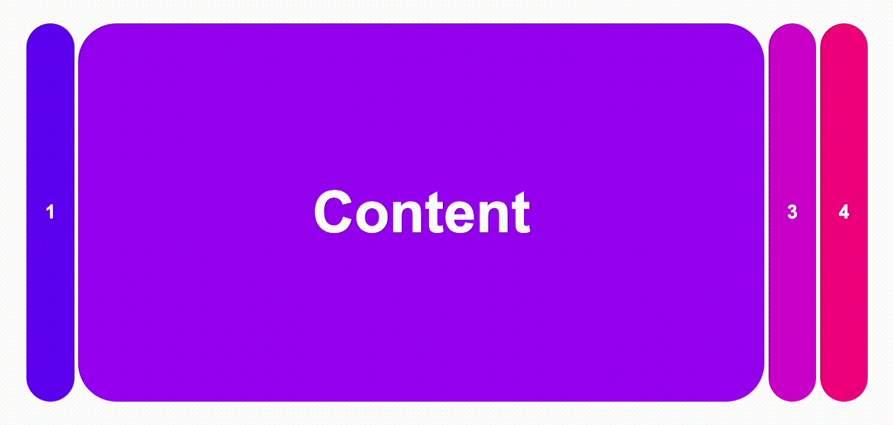

# Shadow DOM Components for Vanilla HTML/CSS/JS
These are shadow DOM components that are fully compatible with vanilla web development.

# Showcase
## Light/Dark Mode Switch

### Usage
This one has dynamic width and height to style as you wish, see example below:
```HTML
<light-dark-mode-switch width="10em" height="4em"></light-dark-mode-switch>
```

## Sliding Panels (Under development)

### Usage
Inside of each panel you can add your own HTML for the content, as you can see in the code example below everything inside of the divs with a slot attribute can be changed.
```HTML
<sliding-panels>
    <div slot="panel1-content">
        <p>First</p>
    </div>
    <div slot="panelLabel1-content">1</div>

    <div slot="panel2-content">
        <h1>Content</h1>
    </div>
    <div slot="panelLabel2-content">2</div>

    <div slot="panel3-content">
        <p>Third</p>
    </div>
    <div slot="panelLabel3-content">3</div>

    <div slot="panel4-content">
        <p>Forth</p>
    </div>
    <div slot="panelLabel4-content">4</div>
</sliding-panels>
```

# License
Use as you please!